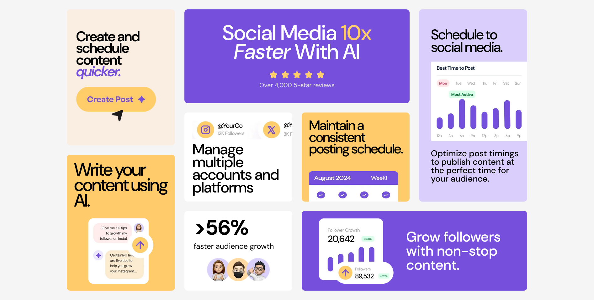

# Frontend Mentor - Bento grid solution

This is a solution to the [Bento grid challenge on Frontend Mentor](https://www.frontendmentor.io/challenges/bento-grid-RMydElrlOj). Frontend Mentor challenges help you improve your coding skills by building realistic projects. 

## Table of contents

- [Overview](#overview)
  - [The challenge](#the-challenge)
  - [Screenshot](#screenshot)
  - [Links](#links)
- [My process](#my-process)
  - [Built with](#built-with)
  - [What I learned](#what-i-learned)
  - [Continued development](#continued-development)
- [Author](#author)

## Overview

This is a platform that display different aspect or section about social media. this was built using CSS Grid

### The challenge

Users should be able to:

- View the optimal layout for the interface depending on their device's screen size

### Screenshot

### Links

- Solution URL: [Solution URL](https://www.frontendmentor.io/challenges/bento-grid-RMydElrlOj)
- Live Site URL: [Live Site](https://bento-grid-gamma-one.vercel.app/)

## My process

I started be structuring my container tag element, then i moved forward to positoning them in d grid

### Built with

- Semantic HTML5 markup
- CSS custom properties
- Flexbox
- CSS Grid
- Mobile-first workflow
- [React](https://reactjs.org/) - JS library
- [Vite](https://vite.dev/) - JS library

### What I learned

UI learnt i can use different unit for my grid column templates. eg fr, %, px and others

### Continued development

I want to focus on developing more using grid cause it is so smooth and faster

## Author

- Frontend Mentor - [@Kenzkyi](https://www.frontendmentor.io/profile/Kenzkyi)
- Twitter - [@EkeneOkoye20](https://www.twitter.com/EkeneOkoye20)
